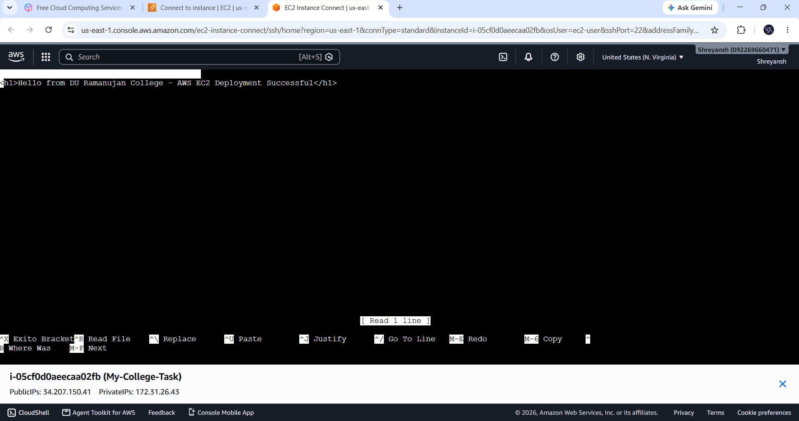

# AWS EC2 Web Hosting Project

## Overview
This project demonstrates hosting a simple static website on Amazon EC2 using Apache Web Server.

## Student Details
- **Institution:** DU Ramanujan College
- **Course:** B.Sc. Computer Science (1st Year)

## Project Proofs
- **Website Screenshot:**
  

- **AWS EC2 & Public IP Screenshot:**
  

## Deployment Steps
1. Launched an AWS EC2 instance.
2. Installed and configured Apache Web Server (`httpd`).
3. Created an `index.html` file in `/var/www/html/`.
4. Accessed the site via Public IPv4 address.
